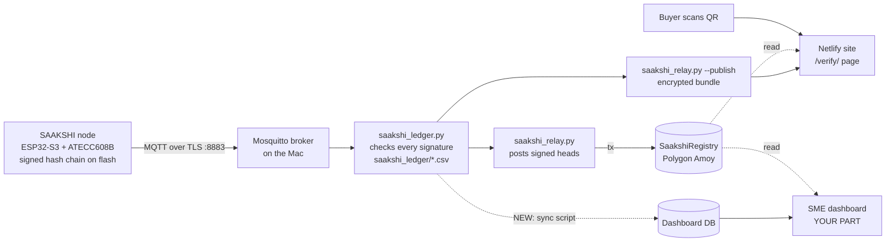

# SAAKSHI: Handover for the Dashboard

**Team AEGIS_X · Smart India Hackathon 2026 · Problem Statement 26232 (MoFPI)**
**"Low-Cost IoT Blockchain Nodes for Farm-to-Fork Traceability"**
Written 5 Oct 2026. Everything below is built and tested unless it says otherwise.

---

## 0. Read this first

You are building the **SME dashboard**: the place where an exporter logs in, sees their SAAKSHI nodes and trips, gets alerts, and shares a QR with their buyer.

One rule shapes everything: **SAAKSHI's whole point is that nobody has to trust AEGIS_X.** Every reading is signed inside a security chip, chained to the one before it, and anchored on a public blockchain. The buyer checks all of that on their own phone, with no login. So:

- The dashboard is a **convenience layer for the node's owner**. It must never be needed to prove a record is genuine.
- The public **verification page** (already built, section 6) stays independent of the dashboard. If the dashboard went offline, every QR must keep working.
- **No private keys ever go into the dashboard or its database.** Not the wallet key, not the broker CA key. Section 9 lists exactly what is secret.

---

## 1. What SAAKSHI is (one paragraph)

A sealed box that travels with produce. It logs temperature, humidity, pressure, gas (and ethylene, once fitted), jolts and movement every 10 s on the bench (5–15 min in the field). Each record is hashed with SHA-256 and signed by an **ATECC608B** chip whose private key can't be extracted. Each record contains the hash of the one before it, so editing, deleting or reordering anything is detectable. Records are stored on flash through network dead zones and synced over **MQTT (TLS-encrypted)** to a **ledger** on a laptop, which only keeps records with valid signatures. A **relay** posts the newest signed record ("head") to a smart contract on **Polygon Amoy**, which checks the chip's signature itself before accepting it. A **QR on the box** opens a page that re-checks everything in the buyer's browser.

---

## 2. Architecture



The dashboard's data comes from the **ledger's files on the Mac** (only verified records live there), through a small sync script (section 7.4). It reads anchor status straight from Polygon, the same way the verification page does.

---

## 3. What is built (status)

| Part | File(s) | Status |
|---|---|---|
| Node firmware v7 | `saakshi_node_v7.ino` | ✅ Proven: signing, hash chain, store-and-forward, plain MQTT |
| Node firmware **v7.1** | `saakshi_node_v7_1/` (+ `secrets.h`, `broker_ca.h`) | ⚠️ Built and uploaded; TLS sync **not yet confirmed on hardware** (see 3.1) |
| Ledger | `saakshi_ledger.py` (+ `saakshi_pull.py`) | ✅ Verifies every record before storing; now has `--tls` |
| Encrypted broker setup | `saakshi_broker.py` | ✅ Own CA, broker cert for the Mac's IP, per-node logins, ACLs |
| Smart contract | `SaakshiRegistry.sol` | ✅ **Deployed** on Polygon Amoy, verifies P-256 signatures on-chain |
| Relay | `saakshi_relay.py` | ✅ Registered the node and anchored a head; forged head refused |
| Verification page + QR | `saakshi_site/verify/` (`index.html`, `core.js`, `ui.js`) | ✅ Tested on the real 2,127 records, shows "Genuine record" |
| **Dashboard** | — | ❌ **Your part** |

### 3.1 Hardware situation right now (5 Oct)

- The original YD-ESP32-S3 board was destroyed. A **new ESP32-S3** board is running v7.1.
- The ATECC608 currently wired is a **fresh, never-configured chip** (serial `0123E78383D4E808EE`). We're testing the second ATECC608 to see whether it's the original (node `SAAKSHI-25D8016E`). If not, the fresh chip will be set up and the node gets a **new node ID**. **The dashboard must handle more than one node per owner from day one.**
- The MPU-6050 (motion sensor) isn't detected yet (wiring).
- The old node's 2,127 records are safe in the ledger and anchored on Polygon.

### 3.2 Proven facts you can show

- Polygon's own P-256 checker verified a real ATECC608 signature: **VALID**, and one changed bit was **rejected**.
- `SaakshiRegistry` at **`0xA82128628b7Ae42183d9B76020CD37C007c18c46`** (Amoy, chain id 80002).
- Node `SAAKSHI-25D8016E` registered in block **49371011**. Head **seq 2126** (locks in seq 0–2126, chain `0674cefd`) anchored in block **49371015** on 5 Oct 2026, 15:14 IST.
- A forged head (temperature changed to 2.000 °C, real signature kept) was refused by the contract: `BadSignature`.
- The verification page re-checked all 2,127 records and the anchor in the browser: **Genuine record**.

---

## 4. Identities and names

| Thing | Format | Example | How it's made |
|---|---|---|---|
| **Node ID** | `SAAKSHI-` + 8 uppercase hex | `SAAKSHI-25D8016E` | First 4 bytes of SHA-256 of the 65-byte public key `04‖x‖y` |
| **Public key** | 130 hex chars, starts `04` | `04BF70A4…F56336` | Read from the ATECC608; public, safe to store and show |
| **keyHash** (on-chain) | 32 bytes | sha256(`04‖x‖y`) | Node ID = its first 4 bytes |
| **Chain ID** | 8 lowercase hex | `0674cefd` | First 4 bytes of the hash of record seq 0. A new chain starts when the board's storage is cleared. **Treat one chain as one "trip"** |
| **seq** | integer from 0 | `2126` | Increments by one per record within a chain |

---

## 5. Data formats you will consume

### 5.1 A record (firmware `Record` struct, little-endian, 174 bytes)

The first **78 bytes** are hashed (SHA-256) into `hash`, and the chip signs `hash`.

| Field | Type | Unit / meaning |
|---|---|---|
| `seq` | uint32 | position in the chain |
| `boot_id` | uint32 | increments every power-on |
| `uptime_s` | uint32 | seconds since this boot |
| `unix_time` | uint32 | UTC seconds; **0 = clock not set** (flag `NO_TIME`) |
| `temp_mc` | int32 | BME688, milli-°C |
| `rh_mpct` | int32 | milli-% relative humidity |
| `press_pa` | int32 | Pa |
| `gas_ohm` | int32 | gas resistance, Ω (VOC indicator) |
| `rtc_temp_cc` | int16 | DS3231 thermometer, centi-°C; −32768 = not answering |
| `mpu_temp_cc` | int16 | MPU-6050 thermometer, centi-°C; −32768 = not answering |
| `peak_mg` | uint16 | biggest jolt since the last record, milli-g |
| `moves` | uint16 | 20 ms moments with movement since the last record |
| `sensor_id` | uint32 | BME688 calibration fingerprint (detects a swapped sensor) |
| `flags` | uint16 | see 5.2 |
| `prev_hash` | 32 bytes | hash of the previous record (zeros for seq 0) |
| `hash` | 32 bytes | SHA-256 of the 78 bytes above |
| `sig` | 64 bytes | ECDSA P-256 r‖s over `hash`; zeros if `UNSIGNED` |

### 5.2 Flags

| Bit | Name | Meaning | Dashboard should… |
|---|---|---|---|
| `0x0001` | BOOT | first record after power-on | count restarts |
| `0x0002` | SENSOR_FAIL | BME688 reading failed (its 4 fields are 0) | skip in charts, warn |
| `0x0004` | NO_TIME | clock not set, `unix_time` = 0 | plot by seq, not time |
| `0x0008` | CLOCK_SET | the clock was set just before this record | info |
| `0x0010` | MOTION | the box moved | movement timeline |
| `0x0020` | SHOCK | jolt over 1 g | **alert** |
| `0x0040` | TEMP_MISMATCH | BME688 disagrees with both backup thermometers by more than 6 °C | **alert** |
| `0x0080` | SENSOR_CHANGED | BME688 fingerprint changed (possible sensor swap) | **red alert** |
| `0x0100` | UNSIGNED | the chip couldn't sign this record; it's covered by the next signed one | warn if many |
| `0x0200` | RTC_FAIL | DS3231 not answering | warn |
| `0x0400` | MPU_FAIL | MPU-6050 not answering | warn |

v8 (later) will add an **ethylene** reading and a **lid-open** flag. Keep the schema easy to extend.

### 5.3 Ledger files (on the Mac): the dashboard's main source

- Folder `saakshi_ledger/`, one file per chain: **`<NODE_ID>_<chain>.csv`**, for example `SAAKSHI-25D8016E_0674cefd.csv`.
- **Only verified records are written.** The ledger checks hash, link and signature first.
- Columns:
  ```
  seq,boot,uptime_s,unix_time,temp_c,rh_pct,pressure_hpa,gas_kohm,rtc_temp_c,mpu_temp_c,peak_g,moves,sensor_id,flags,prev_hash,hash,sig
  ```
  `temp_c` has 3 decimals, `pressure_hpa` 2, `gas_kohm` 3, `peak_g` 3; `rtc_temp_c` and `mpu_temp_c` are empty if not answering; hashes and sig are `0x…` hex; `sensor_id` is `0x%08x`.
- Rejected or suspicious events go to `saakshi_ledger/alerts.log`. Surface these as alerts.
- The file only grows (append). The last line may be half-written while the ledger is busy, so skip a line with no trailing newline.

### 5.4 MQTT topics (for reference; the dashboard should *not* connect to the broker)

| Topic | Who sends | Payload |
|---|---|---|
| `saakshi/<node>/status` (retained) | node | `online chain=<8hex> next=<n> key=04…` / `offline chain=…` (last will) |
| `saakshi/<node>/rec/<chain>` | node | 1–5 CSV record lines (5.3 columns), newline-separated |
| `saakshi/<node>/ack` | ledger | contains `chain=<8hex> next=<n>` (ledger holds every seq below n) |
| `saakshi/<node>/cmd` | ledger | `chain=… resend=<n>` and/or `time=<unix>` |

The broker requires TLS (port 8883) and a login, and each node may only publish to its own topics.

### 5.5 On-chain: SaakshiRegistry (read-only calls are free)

- Network: **Polygon Amoy**, chain id **80002**
- RPC (browser-friendly): `https://polygon-amoy-bor-rpc.publicnode.com` (fallback `https://polygon-amoy.drpc.org`)
- Explorer: `https://amoy.polygonscan.com`
- Address: **`0xA82128628b7Ae42183d9B76020CD37C007c18c46`**

| Function | Selector | Returns |
|---|---|---|
| `node(bytes32 keyHash)` | `0x7c97e6ec` | `x, y, registered` (block time; 0 = not registered) |
| `headCount(bytes32 keyHash)` | `0xd9701e33` | number of anchored heads |
| `headAt(bytes32 keyHash, uint256 i)` | `0x7b751af0` | record hash of head *i* (oldest first) |
| `isAnchored(bytes32 recordHash)` | `0x4f0b5801` | `anchored, keyHash, seq, nodeTime, blockTime, relayer` |

Events: `NodeRegistered(keyHash, nodeId, x, y, by)` and `HeadAnchored(keyHash, recordHash, seq, nodeTime, index, relayer)`.

**How to compute "anchored up to seq X":** get the node's heads, find the newest record in the chain whose `hash` is among them, then `isAnchored(hash).blockTime` gives the time. Every record at or before that seq is locked. `saakshi_site/verify/core.js` already does exactly this (`readAnchors()`), so **reuse it**.

### 5.6 Relay output

- `saakshi_relay/posted.json`: every head this relay posted: `{chain, seq, hash, tx, block, time}`. Use it for "view transaction" links.
- `saakshi_relay/config.json`: contract address, RPC, site URL, allowed temperature range.

### 5.7 Published bundle (for the verification page)

- `saakshi_site/verify/data/index.json`: `{"nodes": {"<NODE>": [{chain, file, count, firstSeq, published}]}}`
- `saakshi_site/verify/data/<NODE>_<chain>.json`: public hashes and signatures, plus the readings **encrypted** with AES-256-GCM (format `saakshi-bundle/1`).
- **Buyer link format:** `https://<site>/verify/?n=<NODE>[&c=<chain>]#k=<view key>`. The `#k=` part is the decryption key; browsers never send it to the server.

---

## 6. The verification page (already done; don't rebuild it)

- `saakshi_site/verify/`: static, works on Netlify, no backend.
- With the key, it decrypts and re-checks every hash, link and chip signature in the browser, then reads the anchor from Polygon. Verdicts: **Genuine record**, **Genuine, partly anchored**, **Signed, not yet anchored**, **Record altered / Can't unlock**.
- Without the key, it shows **Anchored record** and says the readings are encrypted.
- Shows the trip: temperature and humidity charts, lowest/average/highest, jolts, restarts, sensor-swap warnings.
- **Dashboard's job here:** generate and show the **QR / share link** for each node or trip. Don't duplicate the verification logic in the backend.

---

## 7. The dashboard: what to build

### 7.1 Who uses it

| User | Needs | Login? |
|---|---|---|
| **SME exporter (owner)** | see their nodes and trips, live status, alerts, share QR with buyers | yes |
| **Buyer / inspector** | check one shipment | **no**: they use the QR page |
| Anyone | understand SAAKSHI, request nodes | no (landing page) |

### 7.2 Pages

1. **Landing page (public):** what SAAKSHI does in one screen, the "verified on your phone, anchored on Polygon" story, price per node (₹ from the BOM sheet, confirm with the team), and a **"Request nodes" form** (name, company, phone, email, number of nodes, product type). **No payments or cart.**
2. **Sign up / log in:** email + password (Supabase Auth). One organisation per account is enough for the demo.
3. **My nodes:** a card per node:
   - node ID, a friendly name the owner sets ("Mango crate 1"), photo optional
   - **status**: Online / Offline (last record received more than 3 × log interval ago) / Never seen
   - last reading (temp, RH, time), current trip (chain)
   - badges: 🔒 anchored up to seq X (time), ⚠️ open alerts
4. **Node detail / Trip view:**
   - trip selector (one chain = one trip)
   - temperature chart with the allowed band shaded, plus humidity, pressure, gas (VOC), and later ethylene
   - jolts timeline (`peak_g`, `SHOCK`) and movement (`moves`, `MOTION`)
   - stats: from/to, duration, lowest/average/highest, time outside the allowed band, jolts, restarts
   - **integrity panel**: records verified by the ledger, unsigned count, **anchored up to seq X at time T** with a PolygonScan link (from `posted.json` or by reading the chain)
   - **Share with buyer**: QR image + link (section 5.7)
   - export: CSV of the trip (later: GS1 EPCIS 2.0)
5. **Alerts:** list with filters, acknowledge button. Types (configurable per node or trip):
   - temperature outside the allowed band for more than N minutes (default band 2–8 °C for cold chain; per-product settings, e.g. banana 13–15 °C)
   - jolt over 1 g (`SHOCK`)
   - **sensor swapped** (`SENSOR_CHANGED`): high severity
   - temperature mismatch (`TEMP_MISMATCH`)
   - node offline for more than X minutes
   - many unsigned records in a row (security chip trouble)
   - ledger alerts (from `alerts.log`): a refused record means **tampering was attempted**, which is high severity
   - head not anchored for more than X hours
6. **Settings:** node names, allowed band per node/trip, alert thresholds, team members (optional).

### 7.3 Suggested tech (free tier)

- **Frontend:** any static stack you're fast with (React/Vite or plain HTML+JS), on **Netlify**, either as a separate site or `/app/` on the same one.
- **Backend:** **Supabase** free tier: Auth + Postgres + Row Level Security, so each org only sees its own rows.
- **Charts:** Chart.js or Recharts. Downsample long trips (the verify page buckets to ~320 points with a min/max envelope; copy that idea).
- **Chain reads:** reuse `saakshi_site/verify/core.js` (`readAnchors`, `makeRpc`, selectors), so there's no web3 library needed.

### 7.4 Getting data in: the sync script (new, small)

A Python script on the Mac next to the ledger (`saakshi_dashboard_sync.py`, to be written) that every ~30 s:

1. Reads each `saakshi_ledger/<NODE>_<chain>.csv` from where it last stopped (keep a byte offset per file).
2. Parses rows (same parser as `saakshi_relay.py`'s `parse_row`, so copy it) and **upserts** them into `readings`.
3. Updates `nodes.last_seen` / `chains.last_seq`, and creates alerts per the rules above.
4. Reads `saakshi_relay/posted.json` into `anchors`.
5. Tails `saakshi_ledger/alerts.log` into `alerts`.

It uses the Supabase **service key**, which stays **only on the Mac** (in an env var or a file in `.gitignore`), **never** in the frontend. The frontend uses the public anon key + RLS.

Why not read MQTT directly? The broker is local, TLS-only and login-protected, and the ledger is the component that checks signatures. Only the ledger's verified output should reach the dashboard.

### 7.5 Database tables (starting point)

```sql
orgs            (id uuid pk, name text, created_at timestamptz)
members         (org_id uuid, user_id uuid, role text)                 -- RLS anchor
nodes           (node_id text pk, org_id uuid, pubkey text, name text,
                 log_interval_s int default 600, temp_lo numeric, temp_hi numeric,
                 last_seen timestamptz, created_at timestamptz)
chains          (node_id text, chain_id text, first_seq int, last_seq int,
                 started_at timestamptz, ended_at timestamptz, label text,
                 primary key (node_id, chain_id))
readings        (node_id text, chain_id text, seq int, unix_time bigint,
                 temp_c numeric, rh_pct numeric, pressure_hpa numeric, gas_kohm numeric,
                 rtc_temp_c numeric, mpu_temp_c numeric, peak_g numeric, moves int,
                 sensor_id text, flags int, signed boolean, hash text,
                 primary key (node_id, chain_id, seq))
anchors         (node_id text, chain_id text, seq int, record_hash text,
                 tx text, block bigint, anchored_at timestamptz)
alerts          (id bigserial pk, node_id text, chain_id text, seq int, type text,
                 severity text, message text, created_at timestamptz, acked_by uuid, acked_at timestamptz)
share_links     (node_id text, url text, created_at timestamptz)        -- QR link incl. #k=
order_requests  (id bigserial pk, name text, company text, phone text, email text,
                 nodes int, product text, created_at timestamptz)
```

RLS: every table filtered by `org_id` via `nodes` → `members`. `order_requests` is insert-only for anonymous users.

---

## 8. Things that will catch you out

- **`unix_time` can be 0** (clock not set). Plot those by seq, or drop them from time-based charts. v7.1 fetches internet time, so new records will mostly have it.
- **`SENSOR_FAIL` rows have zeros** for temperature, RH, pressure and gas. Never plot them as 0 °C.
- **Several chains per node.** A new chain appears after storage is cleared or a board is replaced. Already happened once (5 Oct).
- **Several nodes per owner.** Because of the board replacement, the team may soon have `SAAKSHI-25D8016E` (old trip) **and** a new node ID.
- **Times:** records store UTC. Show IST in the UI.
- **Don't recompute "genuine" in the dashboard from its own DB.** The DB copy is a convenience. Genuineness comes from the ledger check, the on-chain anchor, and the buyer's own check on the QR page.
- **The MPU-6050 may be missing** on the current bench node, so `mpu_temp_c` is empty and jolts are 0. Handle missing sensors gracefully.

---

## 9. Secrets: what never goes into the dashboard or GitHub

| Secret | Where it lives | Notes |
|---|---|---|
| Wallet private key | `relay_key.txt` (Mac) | Pays Polygon fees for posting heads |
| Broker CA private key | `saakshi_broker/ca.key` (Mac) | Whoever has it can impersonate the broker |
| Broker passwords | `saakshi_broker/credentials.json` (Mac) | One per node + ledger |
| WiFi password | `saakshi_node_v7_1/secrets.h` | `.gitignore`d |
| **View (QR) keys** | `saakshi_relay/view_keys.json` (Mac) | Decrypt a node's published readings. The owner may store their own in their dashboard account (`share_links`) under RLS; never public |
| Supabase service key | env var on the Mac | Sync script only |

Public and safe to show: node IDs, public keys, contract address, transaction hashes, record hashes, published bundles (encrypted).

---

## 10. Commands cheat sheet (all run in `~/Downloads` on the Mac)

```bash
python3 saakshi_broker.py run              # encrypted broker (leave running)
python3 saakshi_ledger.py --tls            # ledger (leave running)
python3 saakshi_relay.py --check           # re-check the ledger offline
python3 saakshi_relay.py --once            # anchor the newest signed head on Polygon
python3 saakshi_relay.py --status          # what is anchored
python3 saakshi_relay.py --prove 1500      # when record 1500 was locked
python3 saakshi_relay.py --fake            # demo: forged head is refused (free)
python3 saakshi_relay.py --publish         # encrypt records for the QR page; prints the QR link
python3 saakshi_broker.py renew            # Mac got a new IP: new broker certificate
python3 saakshi_broker.py add-node SAAKSHI-XXXXXXXX   # login for a new node
```

Board (Serial Monitor, 115200, New Line): `s` status · `w` network · `i` identity · `broker <ip>` · `mqttpass <pw>` · `tls on|off` · `d 10` last records · `v` verify chain.

---

## 11. Hard rules (from the main handover)

- **Never run the ArduinoECCX08 example sketches.** They can change or permanently lock a security chip.
- **Never run `saakshi_atecc_setup` on a chip until the team confirms which chip it is.** Locking is permanent.
- Arduino Tools for the YD-ESP32-S3: **Flash Size 16MB**, Partition **16M Flash (3MB APP/9.9MB FATFS)**, PSRAM **OPI**, **Erase All Flash Before Sketch Upload = Disabled**. These settings can silently reset when the IDE updates its board list. Check before every upload.
- Never describe ethylene sensing as "demonstrated" until it's fitted and calibrated.
- The board and the Mac must be on the **same WiFi or hotspot** for the local broker to work.

---

## 12. What else is still open (not dashboard work, for context)

1. Confirm v7.1 TLS sync on the new board; settle the node identity (original chip or new one).
2. MPU-6050 wiring (address 0x69, AD0 to 3V3).
3. Firmware v8: ethylene (ME3-C2H4 + amplifier + ADS1115) and lid-open reed switch. **Changes the record format**, so the ledger, relay, verification page and dashboard sync all get updated together.
4. 4G (A7670C) with WiFi fallback; deep sleep + real current measurement; solar charging.
5. GS1 EPCIS 2.0 export (fits the dashboard's export button).
6. Secure Boot + flash encryption (last, permanent).
7. Deck: Team ID, public demo video folder, slide 4 parts list to match the real build; add screenshots of the Polygon anchor, the forged-head refusal and the "Genuine record" page.

---

## 13. Definition of done for the dashboard (demo)

- [ ] Landing page + "Request nodes" form saves to the DB
- [ ] Sign up / log in; an org sees only its own nodes
- [ ] Sync script pushes the real ledger CSV (`SAAKSHI-25D8016E_0674cefd.csv`, 2,127 records) into the DB
- [ ] Node list with online/offline + last reading
- [ ] Trip view with charts, stats, jolts, and "anchored up to seq 2126 on 5 Oct 2026, 15:14" read live from Polygon
- [ ] Alerts: excursion, jolt, sensor swap, offline, ledger refusal
- [ ] "Share with buyer" shows the QR; scanning it opens the existing verification page showing **Genuine record**
- [ ] Works on a phone screen
